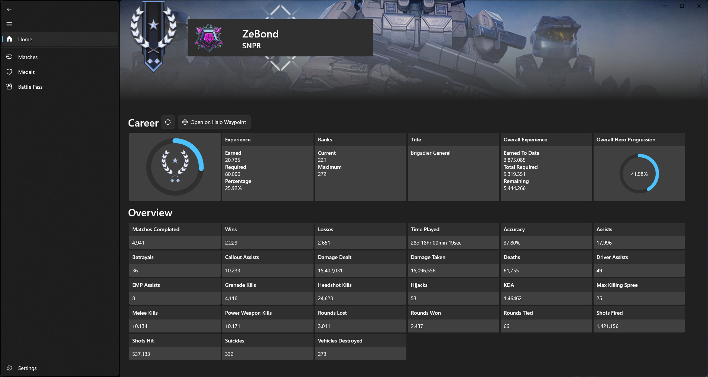
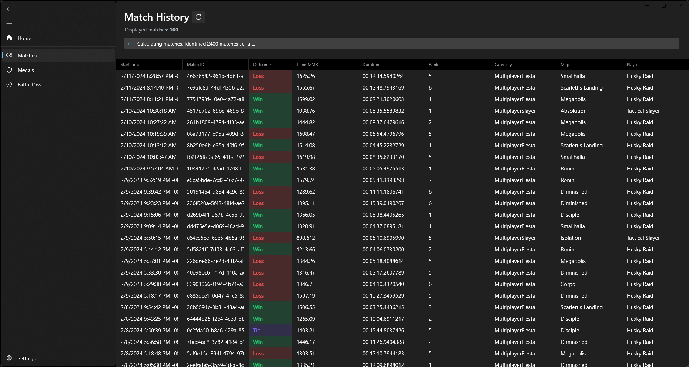
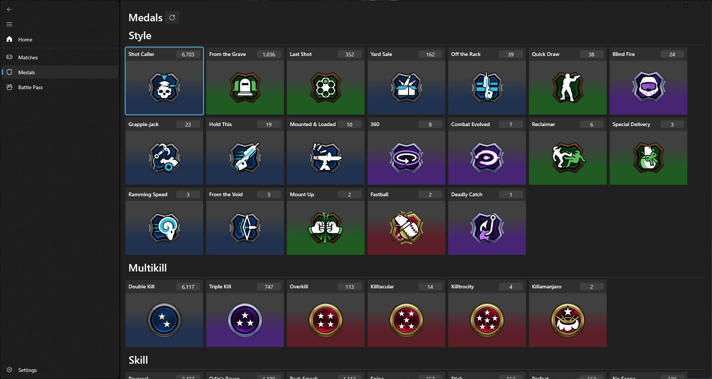
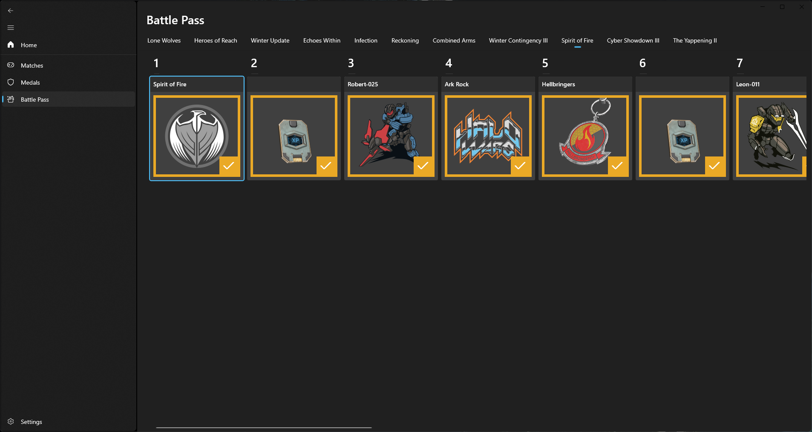

	
	<h1>OpenSpartan Workshop</h1>
	

		<b>Analyze all your Halo Infinite stats in any way you want</b>
	

	 
	 
	 

**OpenSpartan Workshop** is a Windows-based companion application for Halo Infinite. It stores personal stats and metadata through the Halo Infinite API in a local SQLite database, and then renders relevant data through the app.

While you can use OpenSpartan Workshop to quickly see where you are career-wise or details about the matches you played, you can also run SQL queries against the local database through your SQLite client of choice (like [DB Browser](https://sqlitebrowser.org/)), offering unique flexibility in analyzing your in-game performance.

The benefit of using OpenSpartan Workshop is that for any more complex analysis than basic stats you don't really need to interact with the API - all data is stored locally and analysis performance or preferences can be scaled depending on the resources available to you personally (even when offline).

## Download

You can download the application from this repository, in the **Releases** section.

>[!IMPORTANT]
>Requires Windows 10 (20H1 - `10.0.19041.0`) or later, [.NET Desktop Runtime 8.0+](https://dotnet.microsoft.com/download/dotnet/8.0), and the [latest Windows App SDK](https://learn.microsoft.com/windows/apps/windows-app-sdk/downloads). Both are bundled with the installer.

This application is not available through Microsoft Store at this time. Any version there is **not maintained by me**.

## Features

### Career overview

Get a quick glance at your overall career performance. This includes the current career rank and how far you are from the [Hero rank](https://www.halowaypoint.com/news/career-rank-overview-season-4).

### Match metadata

Get an overview of all the matches you've ever played. Click on a match to see details. One of my favorite pieces here is seeing the MMR of your team across all of the matches you've been a part of.

### Medals

An easy way to look at all the medals you've earned, across all of your matches.

### Battle pass details

See what battle pass rewards are coming up, and how far along you are on the level ladder.

## FAQ

### Are you planning to support `{INSERT_PLATFORM_HERE}`?

At this time, my focus is on the Windows app - I want it to be robust, reliable, and stable. Maybe later.

### Can I contribute to localizing the app?

There are no plans to localize the app at this time.

### Why is this app free?

Yes - I [love Halo](https://den.dev/halo), I love writing code, and I wanted to build something for myself to analyze my match stats. This is my way of sharing something good with the Halo community.

### Can I download it somewhere else?

No. If you downloaded the app from somewhere outside this repository, you downloaded the wrong thing. Only downloading from this repository guarantees that your app came from me with no modifications.

### I downloaded the source code but can't build it - why?

You're likely running into dependency issues because the project depends on some of my packages that I didn't make open-source. I currently have no plans on making those open-source. The source code here is for reference only and is not intended for you to build out-of-the-box.

## Disclaimer

This application is **not maintained** and is **not endorsed** by Microsoft, 343 Industries, or any of their subsidiaries. Use at your own risk.

While the application does not abuse any APIs and doesn't interfere in any capacity with any of the Halo games, I **cannot** and **do not guarantee** that your account will not be flagged, suspended, or banned due to the use of this application. If you download, install, and log in, you take full responsibility for any potential future action against your account (if any).

## Contribution

This project is **open-source, not open-contribution** (similar to how SQLite structured [their contribution model](https://www.sqlite.org/copyright.html)). Small bug fixes and issue reports are appreciated, but I very much see this as my own passion project, on my own terms and time.

If you found a bug or have a feature request, [open an issue](/OpenSpartan/openspartan-workshop/issues).
